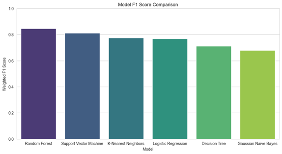
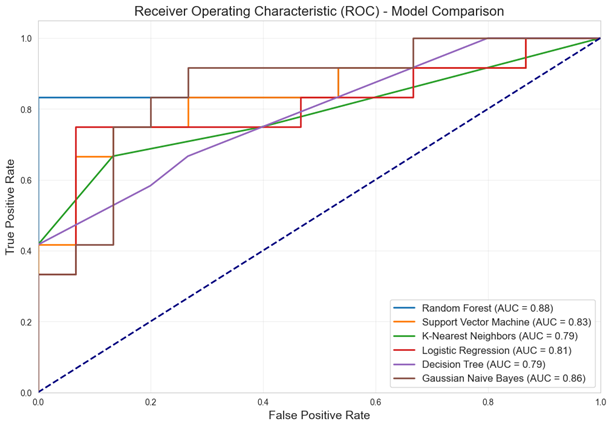
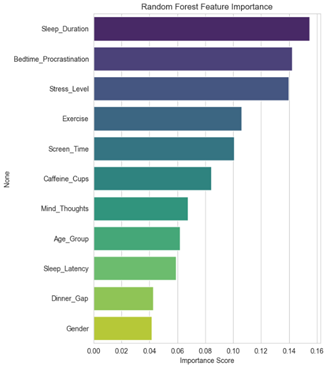

# 💤 Predicting Sleep Quality Via Behavioural and Lifestyle Indicator Analysis

A machine learning project that predicts sleep quality by analyzing modern behavioural data and lifestyle habits across a diverse demographic. This research project shifts the focus from traditional clinical sleep studies to the behavioural roots of sleep deprivation, providing a data-driven foundation for personalized health interventions and future mobile-based sleep monitoring systems.

## 📖 Overview

Traditional clinical studies often prioritize medical disorders like Sleep Apnoea, frequently neglecting the behavioural roots of sleep deprivation that affect individuals across diverse life stages. In the digital age, sleep patterns have shifted drastically due to technological ubiquity and changing social norms.

This project leverages machine learning to analyze a primary dataset of daily habits such as sleep duration, screen time, bedtime procrastination, stress levels, etc. to predict sleep quality. By identifying the specific habits that contribute most significantly to sleep deprivation, this project aims to provide a robust basis for personalized health interventions applicable to a broader society.

## ✨ Key Features

* **Primary Data Collection & EDA:** Analyzed a structured survey dataset representing a diverse demographic spread (from under 18 to over 65) to capture modern metrics like bedtime procrastination, screen time, caffeine intake, etc.
* **Extensive Model Comparison:** Evaluated and optimized six machine learning classifiers (Random Forest, Support Vector Machine, K-Nearest Neighbors, Logistic Regression, Decision Tree, Gaussian Naive Bayes) using `GridSearchCV`.
* **Custom "Overfitting Gap" Validation:** Implemented a rigorous validation framework that mathematically defined an overfitting threshold to guarantee model reliability and real-world generalizability.

## 📊 Key Findings & Results

* **Best Model:** The Random Forest classifier achieved superior performance, proving highly effective at handling non-linear lifestyle data.

  

* **Accuracy:** 85.19% with an ROC-AUC score of 0.88.

  

* **Feature Importance:** The model identified Sleep Duration, Bedtime Procrastination, and Stress Levels as the strongest predictors. This successfully highlights that psychological and behavioral patterns are as critical as biological markers in determining sleep quality.

  

## 🛠️ Technologies

* **Language:** Python
* **Environment:** Jupyter Notebook
* **Data Manipulation & Analysis:** `pandas`, `numpy`
* **Machine Learning:** `scikit-learn` (Model implementations, `GridSearchCV`, `LabelEncoder`, `StandardScaler`)
* **Data Visualization:** `matplotlib`, `seaborn`
